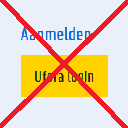
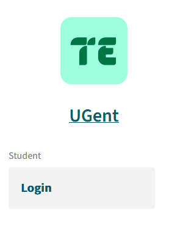
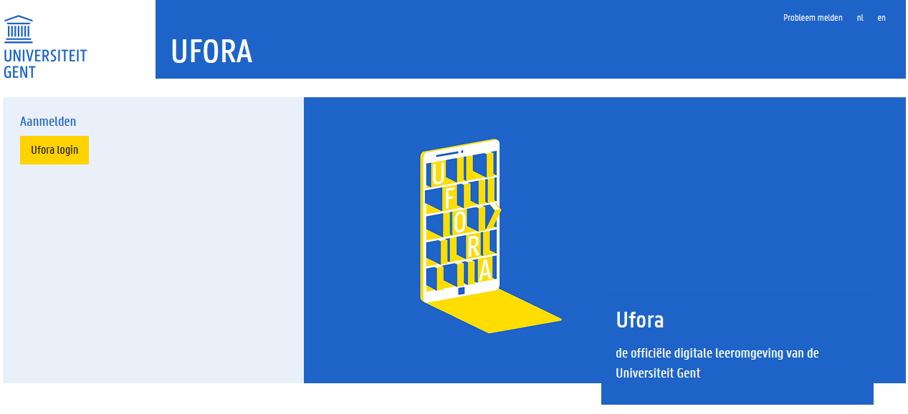
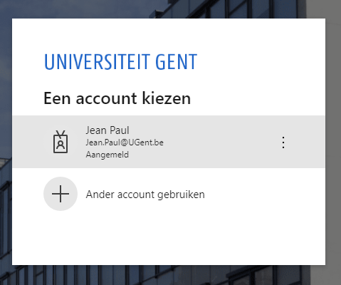
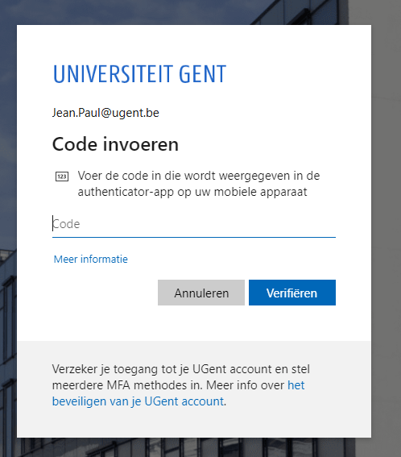
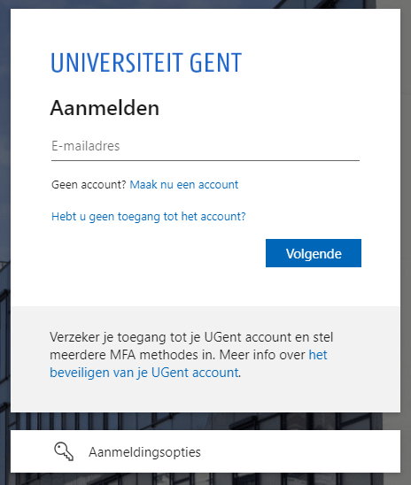

# UGent Auto Login Extension
  
**Why does this exist?**  
you reopen your browser and notice you have to log in to all Ugent-related tabs again.  
This automates clicking "login" on every [login screen](#auto-login-screens).  
This happens in the background, the extension **will not** move your mouse.

**Table of Contents**
* [Installation guide](#installation-guide)
    + [Chrome](#chrome)
    + [Firefox](#firefox)
* [Auto login screens](#auto-login-screens)
* [Manual exceptions](#manual-exceptions)
    + [Microsoft 2FA](#microsoft-2fa)
    + [no saved microsoft account](#no-saved-microsoft-account)
* [Development](#development)
    + [Chrome](#chrome)
    + [Firefox](#firefox)
* [Bugs or Feature Requests](#bugs-or-feature-requests)

## Installation guide
### Chrome
<selfhosted .crx link here>

### Firefox
<selhosted .xpi link here>

## Auto login screens
The login portals you'd see when you're logged out.  
All these login buttons will automatically be clicked.  
**TimeEdit**  
url: `https://cloud.timeedit.net/*`  



**Ufora**  
url: `https://elosp.ugent.be/*`  


**Microsoft**  
url: `https://login.microsoftonline.com/*`  
  
The first `@ugent.be` account always gets chosen.


## Manual exceptions
These are login screens that **cannot be automated**

### Microsoft 2FA
Sometimes, after choosing your account, you'll have to use 2FA to log in again.  
This is because your session token expired.  
That can't be automated. And has to be done every once in a while.  


  
after filling in the password, microsoft might ask for 2FA  
  
This still requires manual work

### no saved microsoft account
  
This means you don't have an account ready to be signed into.  

=> log in to `https://login.microsoftonline.com/` with your UGent account & make sure to "remember" the account.

## Development
You can build & test the extension while developing by using the build script.

```sh
npm run build:<platform>
```

> `platform`
    can either be `chrome` or  `firefox`

The platform specific extension will be built in a new `dist/<platform>` directory

### Chrome
```sh
npm run build:chrome
```
1. Go to `chrome://extensions/` and make sure developer mode is enabled.  
2. "load extracted extension" and select the created `dist/chrome` folder.  

### Firefox
```sh
npm run build:firefox
```

1. zip all the **files** in the `dist/firefox`  folder.  So the .zip shouldn't have a firefox subfolder!
2. go to `about:debugging#/runtime/this-firefox` in Firefox.  
3. click "Load temporary add-on..."  
4. Select the zip.  

note: temporary add-ons expire in 24 hours.

## Bugs or Feature Requests
Please **create an Issue** for bugs or feature requests.  
Pull Requests are always welcome.
